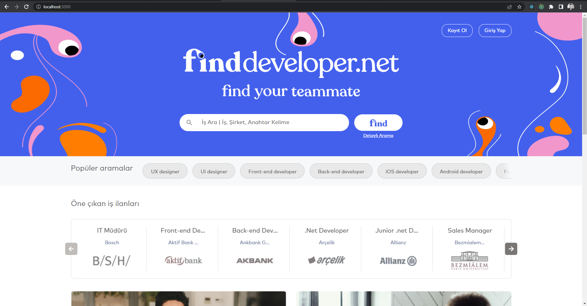
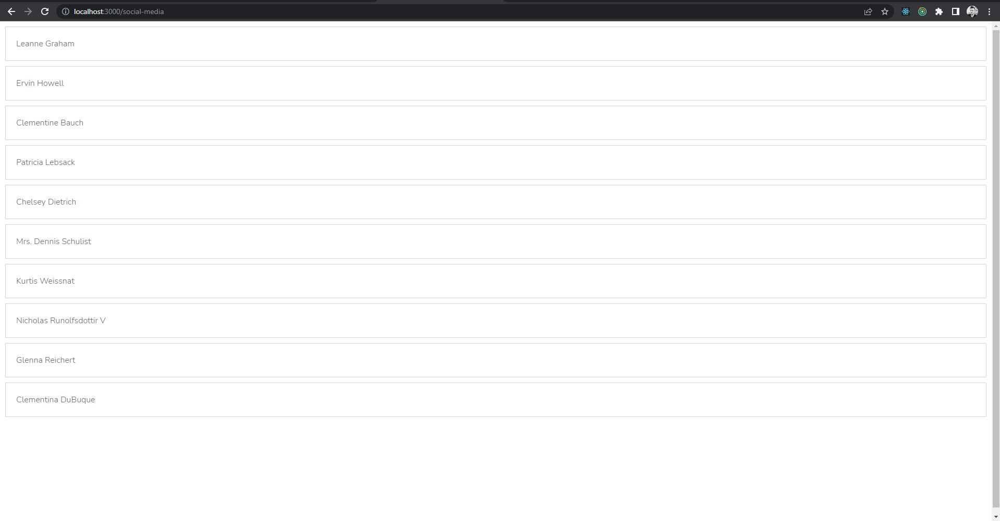
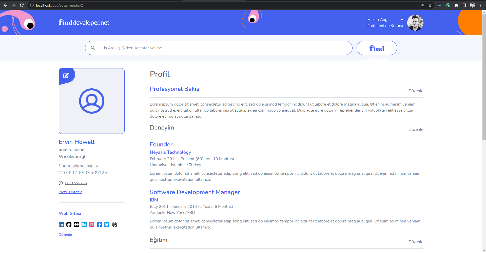
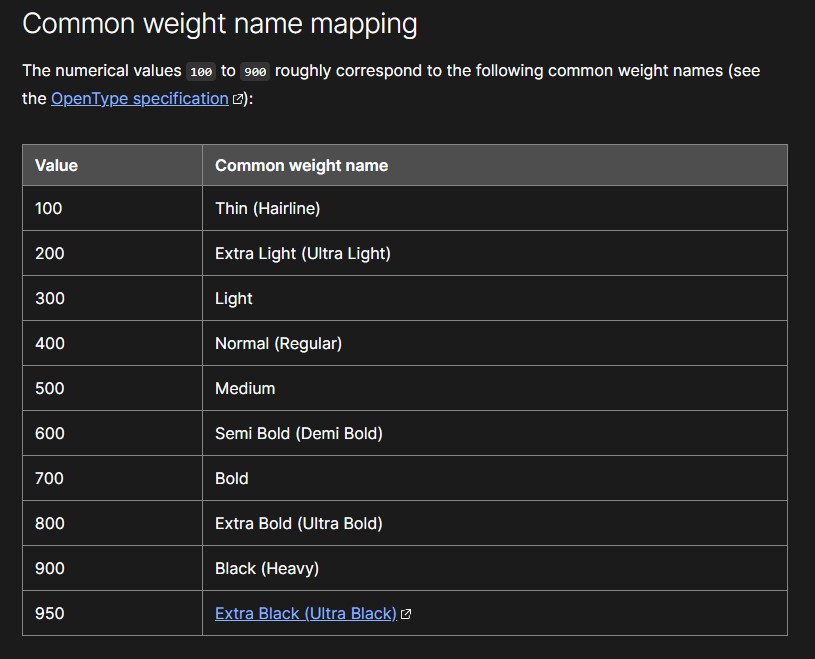

## Kurulum
---

Projeyi local ortamınıza klonladıktan sonra sırasıyla aşağıdaki komutları çalıştırınız. Bu komutlar çalıştırıldıktan sonra projenin çalışması için `package.json` dosyası içerisinde yer alan bağımlılıklar indirilecek ve bu bağımlılıkar proje ana dizininde `node_modules` klasörü içerisinde yer alacaktır.

```bash
npm install
# veya
yarn install
```

## Kullanım
---

Bağımlılıklar indirildikten sonra projeyi `dev` ortamında çalıştırmak için aşağıdaki komutları kullanabilirsiniz. 

Çalışan projeye, [http://localhost:3000](http://localhost:3000) adresinden erişebilirsiniz.

```bash
npm run dev
# veya
yarn dev
```
Eğer [http://localhost:3000](http://localhost:3000) erişim sağladıysanız aşağıdaki gibi bir ekranla karşılaşmanız gerekmektedir. 

Bu ekran Zeplin üzerindeki `001-Home-Page`'i temsil eder.



Anasayfa içerisindeki `Kayıt Ol` veya `Giriş Yap` butonlarına tıkladığınızda ise Zeplin içerisinde bulunmayan ve herhangi bir tasarıma sahip olmayan jsonplaceholder üzerinden API isteğiyle çekilmiş olan bir kullanıcı listesi ile karşılaşırsınız. 



Bu liste üzerinden herhangi bir kullanıcıya tıklayarak detay sayfasına yani Zeplin üzerindeki `002-Social-Media`'i temsil eden sayfaya erişirsiniz. 

Araya tasarımsız bir kullanıcı listesi koymamdaki amaç ise, kullanıcı detaylarına url üzerinden id değiştirerek değil de bir arayüz üzerinden erişilmesini sağlamaktı.



Buradaki sayfa içerisinde dinamik olan kısım, sadece sol tarafta yer alan kullanıcı profil özet bilgileridir.

Kullanıcı detay bilgilerini çekmek için kullandığım endpoint ise [https://jsonplaceholder.typicode.com/](https://jsonplaceholder.typicode.com/) üzerinden kullanılmıştır.

## Notlar
---
- E-posta aracılığıyla gönderilen fontların weight değerlerini [https://developer.mozilla.org/en-US/docs/Web/CSS/font-weight](https://developer.mozilla.org/en-US/docs/Web/CSS/font-weight) adresi üzerinde yer alan `Common weight name mapping`'e göre sınıflandırdım. Ancak Zeplin'deki belirtilen weight değerleri ile görünürde uyumsuzluklar yaşandı. 



- Proje mimarisi olarak `Atomic Design` uygulamaya çalıştım. Componentleri mümkün olduğunda bu yaklaşıma göre konumlandırmaya çabaladım.

### <em>Code Review sonrasında, yaptığım geliştirmelerle ilgili tavsiyelerinizi, olumlu yada olumsuz geri dönüşlerinizi rica ederim.</em>

### Teşekkürler.